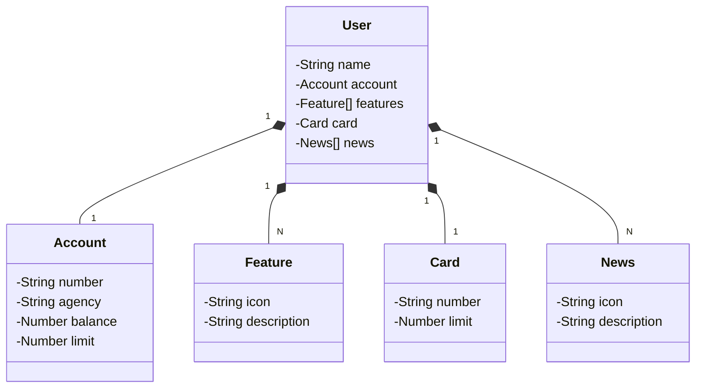

# Restful API

Este projeto é um exemplo de uma API RESTful desenvolvida com Spring Boot. Ele inclui operações básicas para gerenciar usuários, contas, cartões, funcionalidades e notícias.

## Tecnologias Utilizadas

- Java 17
- Spring Boot 3.3.1
- Spring Data JPA
- Springdoc OpenAPI
- H2 Database (para testes)
- PostgreSQL (para produção)
- Railway (Nuvem)

## Diagrama de Classes (Domínio da API)

## API Documentation

Explore a documentação completa da API e teste os endpoints através do Swagger UI:

[Swagger UI - Restful API](https://restful-api-production-f618.up.railway.app/swagger-ui/index.html#/)
